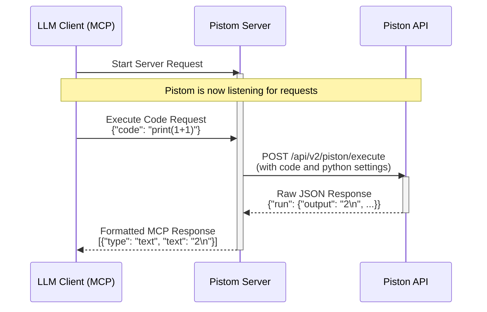

# Pistom

### A Model-Context-Protocol (MCP) Server for Piston

Pistom is a lightweight, zero-configuration server that connects any [Model-Context-Protocol (MCP)](https://github.com/modelcontextprotocol) compatible client (like an LLM agent) to the [Piston API](https://github.com/engineer-man/piston). It provides a secure and sandboxed environment for executing Python code on-demand.


[](https://opensource.org/licenses/MIT)

---

## Table of Contents

- [How It Works](#how-it-works)
- [Key Features](#key-features)
- [Usage](#usage)
- [Important Note: Rate Limiting](#important-note-rate-limiting)
- [Acknowledgements](#acknowledgements)
- [Contributing](#contributing)
- [License](#license)

## How It Works

Pistom acts as a simple, stateless proxy. It receives a code execution request from an MCP client, forwards it to the public Piston API, and then formats Piston's response back into the MCP specification for the client.



## Key Features

- **On-Demand Code Execution**: Instantly grant any LLM the ability to run Python code.
- **Zero-Configuration**: No API keys, sign-ups, or environment variables needed. It just works.
- **Secure by Design**: Code is executed in a remote, sandboxed environment provided by Piston, eliminating risks to your local machine.
- **Lightweight & Zero-Maintenance**: Thanks to `uv`, the server is fetched and run directly from GitHub, ensuring you always have the latest version without manual updates.

## Usage

### Prerequisites

- You must have [**`uv`**](https://docs.astral.sh/uv/) installed.

### 1. Running Standalone (for Testing)

You can start the server directly from your terminal to test its functionality.

```bash
uvx --from git+https://github.com/mdonmez/pistom.git@master pistom
```

This command will download, install, and run the server in one step. The server will start and wait for connections from an MCP client, so it should work without errors.

### 2. Integrating with an MCP Client

To use Pistom with a compatible client, add it to the client's MCP server configuration. The client will then be able to start and communicate with Pistom automatically.

Here is an example configuration snippet:

```json
"pistom": {
      "url": "https://pistom.fastmcp.app/mcp"
    }
```

That's it! Your client is now empowered with Python code execution capabilities.

## Important Note: Rate Limiting

> [!WARNING]
> The public Piston API is rate-limited.
>
> _"The Piston API is rate limited to 5 requests per second..."_  
> — [Piston's documentation](https://github.com/engineer-man/piston)
>
> Please be mindful of this limit in your applications.

## Acknowledgements

Thanks to:

- **[Piston](https://github.com/engineer-man/piston)** for the the free, public code execution engine.
- **[Model-Context-Protocol (MCP)](https://github.com/modelcontextprotocol)** for the protocol and SDK.

## Contributing

Contributions are welcome! If you have a feature request, bug report, or pull request, please feel free to open an issue or submit a PR on the GitHub repository.

## License

This project is licensed under the [MIT License](/LICENSE).
