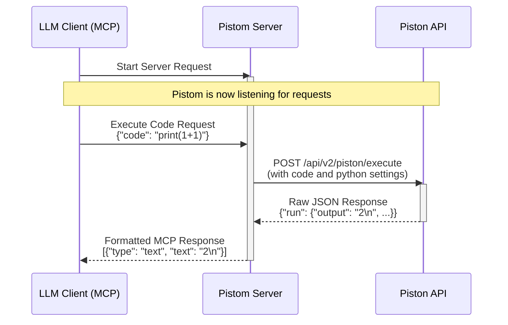

# Pistom

> [!IMPORTANT]
> This repository is archived and kept for reference only.
>
> As of Feb 15, 2026, the public [Piston API](https://github.com/engineer-man/piston) is no longer freely available. Authorization is only granted at EngineerMan's discretion, and is generally limited to non-commercial, low-volume, educational use cases.
>
> If you want to keep using Pistom, run your own Piston instance and update the server to point at it.

### A Model-Context-Protocol (MCP) Server for Piston

Pistom is a lightweight MCP server that connects any [Model-Context-Protocol (MCP)](https://github.com/modelcontextprotocol) compatible client (like an LLM agent) to a Piston instance. It was originally designed around the public API, but this repository is now archived and is no longer maintained.


[](https://opensource.org/licenses/MIT)

---

## Table of Contents

- [Project Status](#project-status)
- [How It Works](#how-it-works)
- [Key Features](#key-features)
- [Usage](#usage)
- [Acknowledgements](#acknowledgements)
- [License](#license)

## Project Status

Pistom is archived.

The code in this repository is preserved as-is and should be treated as historical reference. The public Piston service it was built against is no longer freely open, so existing setups may require authorization or a self-hosted Piston deployment.

## How It Works

Pistom acts as a simple, stateless proxy. It receives a code execution request from an MCP client, forwards it to a Piston API instance, and then formats Piston's response back into the MCP specification for the client.


```mermaid
sequenceDiagram
    participant Client as LLM Client (MCP)
    participant Server as Pistom Server
    participant Piston as Piston API

    Client->>Server: Start Server Request
    activate Server
    Note over Client, Piston: Pistom is now listening for requests

    Client->>Server: Execute Code Request<br>{"code": "print(1+1)"}
    Server->>Piston: POST /api/v2/piston/execute<br>(with code and python settings)
    activate Piston

    Piston-->>Server: Raw JSON Response<br>{"run": {"output": "2\n", ...}}
    deactivate Piston

    Server-->>Client: Formatted MCP Response<br>[{"type": "text", "text": "2\n"}]
    deactivate Server
```

## Key Features

- **On-Demand Code Execution**: Grant an MCP-compatible client the ability to run Python code through Piston.
- **Simple Integration**: The server exposes a minimal MCP tool surface for code execution workflows.
- **Sandboxed Execution**: Code runs in a remote Piston environment rather than on the local machine.

## Usage

### Integrating with an MCP Client

If you are running your own copy of Pistom, add it to your client's MCP server configuration as you normally would for a local or hosted MCP server.

If you are relying on the historical public Piston endpoint, first confirm that you have authorization to use it. Without that authorization, the public service may reject requests.

Example configuration:

```json
"pistom": {
    "url": "https://YOUR-HOSTED-PISTOM-OR-MCP-ENDPOINT/mcp"
}
```

If you fork this repository for your own use, update the Piston base URL in [src/pistom/server.py](src/pistom/server.py) to match your deployment.

## Acknowledgements

Thanks to:

- **[Piston](https://github.com/engineer-man/piston)** for the code execution engine this project was built around.
- **[Model-Context-Protocol (MCP)](https://github.com/modelcontextprotocol)** for the protocol and SDK.

## Contributing

This repository is archived, so contributions are no longer being accepted.

## License

This project is licensed under the [MIT License](/LICENSE).
